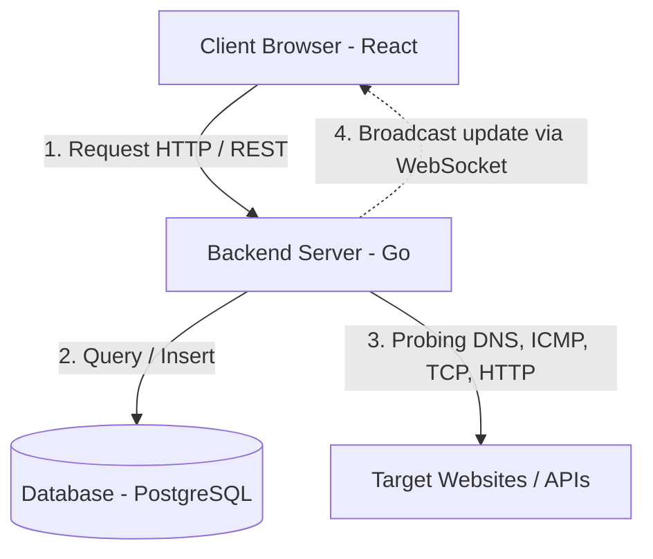

# DOKUMENTASI SISTEM SPMT MONITORING
### **Sistem Monitoring Uptime & Metrik Jaringan Real-Time Berbasis Go, React, dan PostgreSQL**
*Dokumen ini disusun sebagai panduan teknis operasional, dokumentasi serah-terima magang, dan bahan pelaporan akademik (Dosen Pembimbing & Penguji).*

> **Versi dokumen:** 2.0 · **Terakhir diperbarui:** Juni 2026
> Perubahan utama v2.0: ambang batas *response time* disesuaikan ke standar umum (*2-second rule*), kebijakan notifikasi Telegram dirapikan (eskalasi insiden dihapus untuk mencegah spam), serta penambahan panduan **hosting di server kantor**.

---

## 1. PENDAHULUAN
### 1.1 Latar Belakang
Pada lingkungan infrastruktur TI berskala menengah hingga besar (seperti di **Pelindo**), ketersediaan (*availability*) dari aplikasi internal dan eksternal sangat krusial. Down-time pada layanan utama dapat mengganggu produktivitas operasional pelabuhan dan logistik.

Sistem **SPMT Monitoring** dirancang sebagai solusi *Network Operations Center (NOC) Dashboard* yang memantau status kesehatan situs web, layanan API, dan *node* jaringan secara terus-menerus (*24/7*), real-time, dan deterministik.

### 1.2 Tujuan
1. Memantau kesehatan web service melalui multi-protokol (DNS, ICMP/Ping, TCP, HTTP) secara terpusat.
2. Menyediakan dasbor pemantauan real-time yang meminimalkan *lagging* data tanpa membebani peramban (*client polling*).
3. Mencegah *false alarms* (peringatan palsu) akibat gangguan koneksi server lokal atau gangguan sesaat melalui mekanisme cerdas.
4. Mempermudah operator NOC melakukan manajemen status dan audit aktivitas sistem.

---

## 2. ARSITEKTUR SISTEM & ALUR DATA
Sistem menggunakan arsitektur tiga lapis (*three-tier architecture*) dengan pembagian tugas yang efisien:



### 2.1 Backend (Go Engine)
Dipilih bahasa Go karena memiliki performa tinggi (*native code*), konkurensi efisien menggunakan *goroutine*, dan konsumsi memori yang sangat kecil (hemat RAM).
* **Worker Pool Pattern**: Backend menjalankan antrean pekerjaan (*job queue*) berbasis *channel* Go. Sejumlah goroutine worker (default **10**) memproses antrean pengecekan situs web secara paralel.
* **WebSocket Hub**: Bertanggung jawab mempertahankan koneksi persistent ke browser operator dan mem-broadcast setiap metrik terbaru (`monitor_update`) dan notifikasi status (`status_change`).

### 2.2 Frontend (React Client)
React digunakan untuk membangun UI dasbor yang modern, interaktif, dan reaktif terhadap perubahan data.
* **Canvas Topology**: Visualisasi topologi node jaringan digambar secara dinamis pada HTML5 Canvas (tersedia layout Star, Tree, dan 3D Globe).
* **Global WebSocket State**: Komponen UI tidak melakukan *polling* API berulang kali, melainkan berlangganan ke WebSocket Hub untuk langsung menampilkan data begitu diterima.

### 2.3 Database (PostgreSQL)
Menyimpan seluruh konfigurasi website, log historis, riwayat insiden, audit operator, dan sesi pengguna secara relasional dan aman.

---

## 3. LOGIKA DETEKSI STATUS & LOGIKA CERDAS
Sistem menetapkan status kesehatan website secara **deterministik** demi keandalan data. Keputusan diambil bertingkat: **DNS → koneksi/transport → kode HTTP → kecepatan respons**. Implementasi ada di fungsi `classifyStatus` pada `backend/internal/worker/pool.go`.

### 3.1 Klasifikasi Status Kesehatan

| Status | Deskripsi | Kriteria Penentuan Teknis | Notifikasi Telegram |
| :--- | :--- | :--- | :---: |
| **ONLINE** | Layanan normal dan responsif | DNS berhasil diurai **+** HTTP **200–399** **+** waktu respons **≤ 2000 ms**. (HTTP 403/429/503 yang membawa sidik jari WAF/anti-bot/CAPTCHA juga di-*upgrade* ke ONLINE — server jelas hidup, hanya agen otomatis yang ditantang.) | ✅ hanya saat **pemulihan** (kembali dari OFFLINE/CRITICAL) |
| **WARNING** | Layanan hidup tetapi lambat / halaman tidak normal | HTTP **200–399** tetapi **lambat** (respons **> 2000 ms** = "lambat", **> 5000 ms** = "sangat lambat"), **ATAU** HTTP **4xx** selain 403 (mis. 404). | ❌ **senyap** (tidak memicu notifikasi) |
| **CRITICAL** | Server error atau akses ditolak | HTTP **5xx** (Internal Server Error), **ATAU** **403 Forbidden** murni tanpa tanda WAF/verifikasi manusia. | ✅ ya |
| **OFFLINE** | Layanan mati total / tidak terjangkau | DNS gagal diurai, TCP *Connection Refused/Reset*, *Timeout*, atau nihil respons HTTP yang valid. | ✅ ya |

> **Prinsip penting (anti false-alarm):** *kelambatan respons tidak pernah dengan sendirinya menjadi CRITICAL atau OFFLINE.* Situs yang masih menjawab dianggap **degraded (WARNING)**, bukan mati. Menganggap "lambat = mati" adalah penyebab nomor satu alarm palsu, sehingga situs lambat tetap berstatus **WARNING yang senyap**.

### 3.2 Standar & Sumber Ambang *Response Time*
Pemilihan ambang **2000 ms** (batas ONLINE→WARNING) dan **5000 ms** (batas "lambat"→"sangat lambat") mengacu pada standar pengalaman pengguna web yang lazim dipakai industri:

* **Nielsen / Miller — *Response Time Limits*** (Nielsen Norman Group): 0,1 s terasa *instan*; **1 s** menjaga alur pikir pengguna; **10 s** adalah batas perhatian. Di atas ±1–2 detik pengguna mulai merasakan jeda. → mendasari batas "responsif" ≤ 2 s.
* **Google / Akamai — *Page Speed & Bounce Rate*** (riset Google/SOASTA): probabilitas pengguna meninggalkan halaman naik tajam seiring waktu muat — dari 1 s ke 3 s naik ~32%, dari 1 s ke 5 s naik ~90%. → mendasari batas "sangat lambat" di kisaran > 5 s.
* **Apdex (Application Performance Index)**: zona *Satisfied* (≤ T), *Tolerating* (≤ 4T), *Frustrated* (> 4T). Dengan target T ≈ 1 s, zona *Frustrated* mulai sekitar 4–5 s — sejalan dengan label "sangat lambat".

Angka ini sengaja sedikit konservatif (memberi kelonggaran untuk *overhead* jaringan probe) agar tetap akurat namun tidak gampang memicu peringatan palsu.

### 3.3 Kebijakan Notifikasi (Anti-Spam)
Notifikasi Telegram **hanya** dikirim pada tiga transisi yang benar-benar dipedulikan operator:
1. Situs **turun ke OFFLINE**;
2. Situs **turun ke CRITICAL** (server error 5xx / 403 murni);
3. Situs **pulih ke ONLINE** (recovery) — itupun hanya jika sebelumnya memang OFFLINE/CRITICAL, sehingga kedipan WARNING tidak menghasilkan notifikasi pemulihan palsu.

Transisi **WARNING tidak pernah mengirim notifikasi**. **Eskalasi insiden otomatis telah dihapus** karena mekanisme lama mengirim ulang peringatan setiap siklus untuk insiden yang belum ditangani — menyebabkan **spam** di grup Telegram. Email dikirim sebagai **laporan mingguan terjadwal** (`SendWeeklyReport`), bukan per kejadian.

### 3.4 Fitur Cerdas untuk Menekan False Alarms
* **Anti-Flapping (Debounce 3×)**: Status hard-down (`OFFLINE`/`CRITICAL`) tidak langsung dilaporkan pada pengecekan otomatis hingga **3 kali kegagalan berturut-turut**. Mencegah alarm palsu akibat *network blip* sesaat (mis. target sedang restart/deploy).
* **Quorum Internet Check (Local Network Safety)**: Sebelum worker menyatakan suatu situs `OFFLINE`, backend mengecek kesehatan koneksi internetnya sendiri (ping ke DNS publik `8.8.8.8`, `1.1.1.1`, `208.67.222.222`). Jika mayoritas gagal, sistem menyimpulkan **internet node pemantau yang sedang mati** lalu **menahan** insiden, notifikasi, dan pengelompokan kegagalan massal. (CRITICAL/WARNING dikecualikan karena keduanya butuh respons HTTP — bukti konektivitas kita baik.)
* **Anti-Bot/WAF Bypass**: Server yang dilindungi WAF (Cloudflare, Akamai, dll.) sering memblokir bot dengan 403/429/503. Bila terdeteksi sidik jari WAF/CAPTCHA (header `cf-ray`, `server: cloudflare`, atau penanda *challenge* pada body), status di-*upgrade* ke **ONLINE** karena server aslinya hidup.
* **Toleransi Timeout**: *dial timeout* 20 detik & *client timeout* 40 detik sengaja longgar agar situs **lambat-tapi-hidup** jatuh ke **WARNING**, bukan OFFLINE karena timeout dini.

### 3.5 Logika Tombol Refresh (Pengecekan Manual)
1. **Bypass Local Network Check**: refresh manual tetap menjalankan pengecekan penuh apa pun kondisi jaringan lokal, agar log terisi dan `last_checked` diperbarui.
2. **Bypass Debouncing**: refresh manual langsung menulis status sebenarnya tanpa menunggu 3 sampel — status OFFLINE/CRITICAL tampil instan di dasbor.

---

## 4. DESAIN DATABASE (SCHEMA)
Sistem menggunakan skema PostgreSQL dengan relasi terindeks. Migrasi berada di `backend/migrations/001..018_*.sql` dan **dijalankan berurutan** (server tidak menjalankan migrasi otomatis).

### 4.1 Tabel `websites`
* `id` (UUID, PK) · `name` (VARCHAR) · `url` (TEXT) · `interval_seconds` (INT, default 30/60s) · `save_screenshot` (BOOLEAN, opsional).

### 4.2 Tabel `monitoring_logs`
Rekam detail tiap pengecekan (untuk SLA, grafik performa, analisis).
* `id` (UUID, PK) · `website_id` (UUID, FK) · `checked_at` (TIMESTAMPTZ) · `status` (`ONLINE`/`WARNING`/`CRITICAL`/`OFFLINE`) · `dns_resolved` (BOOL) · `dns_latency_ms` · `tcp_port_open` (BOOL) · `tls_latency_ms` · `ttfb_latency_ms` · `status_code` (INT) · `response_time_ms` (INT) · `root_cause` (TEXT, JSON bukti *probing*).

### 4.3 Tabel `status_events`
Sejarah transisi status (untuk notifikasi & laporan).
* `id` (UUID, PK) · `website_id` (UUID) · `old_status` · `new_status` · `created_at` (TIMESTAMPTZ).

### 4.4 Tabel `incidents` & `incident_history`
Insiden **hanya dibuka untuk status hard-down (CRITICAL/OFFLINE)** dan auto-resolve saat kembali ONLINE. WARNING (lambat / 4xx) **tidak** membuka insiden agar daftar insiden tidak berisik.

---

## 5. PANDUAN DEPLOYMENT & INSTALASI

### 5.1 Prasyarat Sistem (*Prerequisites*)
* Go compiler **1.21+** (proyek diuji dengan Go 1.25).
* Node.js **18+** & npm (diuji dengan Node 22).
* PostgreSQL **14+**.

### 5.2 Menjalankan di Lokal (Windows — pengembangan)
Sistem dilengkapi launcher **`start.bat`**:
1. Pastikan PostgreSQL menyala; buat database kosong `spmt_monitoring`.
2. Jalankan seluruh migrasi `backend/migrations/*.sql` secara berurutan.
3. Salin `backend/.env.example` → `backend/.env` lalu sesuaikan koneksi DB.
4. Dobel klik **`start.bat`** — otomatis menjalankan backend (port 8080), Vite dev (port 5173), dan membuka jendela aplikasi.

Default superadmin (ter-*seed* otomatis): username `superadmin`, password `admin123` — **wajib diganti** di lingkungan produksi.

### 5.3 Hosting di Server Kantor (Produksi)
Untuk men-*deploy* ke server kantor (Linux/Windows Server) agar dapat diakses banyak orang:

**a. Siapkan environment produksi (`backend/.env`):**
```env
APP_ENV=production                 # WAJIB: mengaktifkan pemeriksaan keamanan
JWT_SECRET=<acak-panjang-min-32-karakter>   # WAJIB diganti; server menolak start jika masih default
ALLOWED_ORIGINS=https://monitoring.pelindo.co.id   # WAJIB: domain frontend (CORS), pisahkan dengan koma
DB_SSLMODE=require                 # gunakan SSL bila DB di host terpisah
SERVER_PORT=8080
FRONTEND_URL=https://monitoring.pelindo.co.id
TELEGRAM_BOT_TOKEN=<token-bot>
TELEGRAM_CHAT_ID=<chat-id-grup>
```
> Pada `APP_ENV=production`, server **sengaja menolak berjalan** bila `JWT_SECRET` masih default atau `ALLOWED_ORIGINS` kosong — pengaman agar tidak ter-deploy dengan konfigurasi tidak aman.

**b. Build artefak:**
```bash
# Frontend → menghasilkan folder dist/ (file statis)
cd frontend && npm ci && npm run build

# Backend → binari tunggal
cd ../backend && go build -o spmt-server cmd/server/main.go
```

**c. Migrasi database (sekali):**
```bash
# Linux/macOS
for f in backend/migrations/*.sql; do psql -U postgres -d spmt_monitoring -f "$f"; done
# Windows PowerShell
Get-ChildItem backend/migrations/*.sql | Sort-Object Name | ForEach-Object { psql -U postgres -d spmt_monitoring -f $_.FullName }
```

**d. Jalankan backend sebagai service** (contoh `systemd` di Linux):
```ini
# /etc/systemd/system/spmt-monitoring.service
[Unit]
Description=SPMT Monitoring Backend
After=network.target postgresql.service

[Service]
WorkingDirectory=/opt/spmt/backend
EnvironmentFile=/opt/spmt/backend/.env
ExecStart=/opt/spmt/backend/spmt-server
Restart=always
RestartSec=5

[Install]
WantedBy=multi-user.target
```
```bash
sudo systemctl daemon-reload && sudo systemctl enable --now spmt-monitoring
```

**e. Sajikan frontend + reverse proxy (contoh Nginx):** arahkan domain ke folder `dist/` untuk file statis, dan *proxy* `/api`, `/ws`, dll. ke backend `:8080` (pastikan header `Upgrade`/`Connection` diteruskan agar WebSocket berfungsi):
```nginx
server {
    listen 443 ssl;
    server_name monitoring.pelindo.co.id;
    # ... ssl_certificate ...

    root /opt/spmt/frontend/dist;
    location / { try_files $uri /index.html; }

    location /ws {
        proxy_pass http://127.0.0.1:8080;
        proxy_http_version 1.1;
        proxy_set_header Upgrade $http_upgrade;
        proxy_set_header Connection "upgrade";
        proxy_read_timeout 86400s;
    }
    location ~ ^/(auth|websites|dashboard|users|notifications|incidents|metrics) {
        proxy_pass http://127.0.0.1:8080;
        proxy_set_header Host $host;
        proxy_set_header X-Forwarded-For $proxy_add_x_forwarded_for;
    }
}
```
> Atur `frontend/.env` `VITE_API_URL` ke origin publik (atau biarkan relatif bila di-proxy satu domain) **sebelum** `npm run build`.

**f. Firewall:** buka hanya port 80/443 ke publik; port 8080 & 5432 cukup di jaringan internal.

### 5.4 Status Kelayakan Deploy (hasil uji terakhir)
| Pemeriksaan | Perintah | Hasil |
| :--- | :--- | :---: |
| Build backend | `go build ./...` | ✅ Lulus |
| Unit test backend | `go test ./...` | ✅ Lulus (worker + notification) |
| `go vet` | `go vet ./...` | ✅ Bersih |
| Build frontend produksi | `npm run build` | ✅ Lulus (`dist/`) |
| Generator PPT | `node presentation/build.js` | ✅ Menghasilkan `.pptx` |

---

## 6. APAKAH FALSE ALARM HILANG SETELAH DI-HOSTING?
Ringkasnya: **pendapat Anda sebagian besar benar, tetapi tidak 100%.** Hosting akan **sangat mengurangi** false alarm, namun tidak menghilangkannya sepenuhnya. Rinciannya:

**Yang benar:** Saat masih dijalankan dari perangkat & jaringan lokal Anda yang sering "lelet", *node pemantau* itu sendiri punya koneksi yang tidak stabil. Karena waktu respons dan timeout diukur **dari sisi node pemantau**, jaringan yang lelet membuat situs sehat terlihat **lambat (WARNING)** atau bahkan **OFFLINE (timeout)**. Begitu di-hosting di server kantor dengan koneksi datacenter yang stabil, pengukuran menjadi jauh lebih akurat dan mayoritas false alarm jenis ini hilang.

**Yang perlu dicatat (false alarm masih mungkin terjadi):**
1. **Server/penyedia hosting lambat** — seperti yang Anda sebut, jika server tempat hosting sendiri yang lelet/overload, pengukuran ikut terganggu.
2. **Keandalan jaringan kantor** — node pemantau kini bergantung pada kestabilan internet/intranet kantor; jika jaringan kantor terganggu, alarm bisa muncul lagi (di sinilah *Quorum Internet Check* membantu menahannya).
3. **DNS split-horizon Pelindo** — DNS internal kantor dapat mengembalikan IP privat yang tidak terjangkau untuk situs publik (Cloudflare), sehingga situs sehat terlihat OFFLINE. (Mitigasi: *fallback* ke DNS publik.)
4. **WAF/anti-bot** memblokir agen pemantau (sudah dimitigasi dengan deteksi WAF → ONLINE).
5. **Jendela maintenance** target.

**Kesimpulan:** justru karena itu mekanisme anti-false-alarm (debounce 3×, quorum internet, deteksi WAF, ambang WARNING yang senyap) tetap diperlukan **bahkan setelah hosting**. Hosting menghilangkan penyebab terbesar (jaringan lokal Anda yang lelet), sisanya ditangani oleh mekanisme cerdas di atas.

---

## 7. LAMPIRAN SCREENSHOT (untuk Dokumen & PPT)
Generator PPT (`presentation/build.js`) **otomatis menyematkan** screenshot bila file tersedia. Letakkan berkas berikut di folder **`presentation/screenshots/`** lalu jalankan ulang `node presentation/build.js`:

| Nama file | Isi yang difoto |
| :--- | :--- |
| `02-dashboard-topology.png` | Dashboard utama + peta topologi jaringan |
| `03-website-detail.png` | Modal detail diagnostik satu website (DNS/Ping/HTTP/SSL) |
| `04-server-monitor.png` | Monitor server & jaringan node pemantau |

Selama file belum ada, slide menampilkan kotak *placeholder* bertuliskan "Letakkan screenshot di sini" sehingga PPT tetap dapat di-*generate*. Untuk dokumen ini, sisipkan screenshot yang sama pada bagian yang relevan.

---

## 8. KESIMPULAN & REKOMENDASI PENGEMBANGAN
Sistem SPMT Monitoring telah memenuhi kriteria operasional monitoring NOC modern: tangguh, andal, hemat sumber daya, dan **layak di-deploy/hosting** (seluruh build & test lulus).

### Rekomendasi Selanjutnya:
1. **Containerization (Docker Compose)** — menyatukan DB, backend, dan frontend agar deployment ke server kantor/VPS cukup satu langkah.
2. **Saluran Notifikasi Tambahan** — integrasi ke Microsoft Teams/Slack selain Telegram & Email.
3. **Code-splitting frontend** — bundel produksi saat ini ±876 kB (gzip 263 kB); pertimbangkan *dynamic import* untuk mempercepat muat awal.
